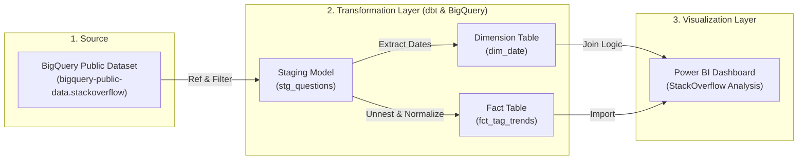

```mermaid
graph LR
    subgraph "1. Source"
        A["BigQuery Public Dataset<br/>(bigquery-public-data.stackoverflow)"]
    end

    subgraph "2. Transformation Layer (dbt & BigQuery)"
        B["Staging Model<br/>(stg_questions)"]
        C["Dimension Table<br/>(dim_date)"]
        D["Fact Table<br/>(fct_tag_trends)"]
    end

    subgraph "3. Visualization Layer"
        E["Power BI Dashboard<br/>(StackOverflow Analysis)"]
    end

    A -->|Ref & Filter| B
    B -->|Extract Dates| C
    B -->|Unnest & Normalize| D
    C -->|Join Logic| E
    D -->|Import| E
```
